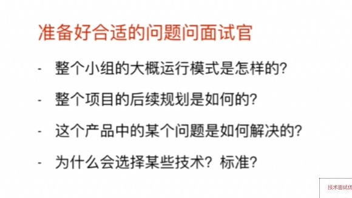
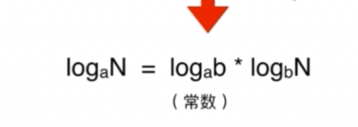

一.算法面试是什么

O 是什么? NlogN 是什么 ? 是以什么样的曲线展示的?
为什么没有底数?

logN 是一个以常数为底数的对数函数,log a N但是在表达复杂度的时候都是会去除常数,那么就会变成 logN

什么情况下会出现O(logN) 复杂度的算法呢? 一般都是会有二分法的情况,比如说是快速排序,

选择一个基准,将

2.复杂度测试

 控制变量法,数据量两倍逐渐扩大,检查时间变化比例

同时传入多个逐级翻倍的数据,检查所需时间的变化

3.递归中的复杂度分析

​	
